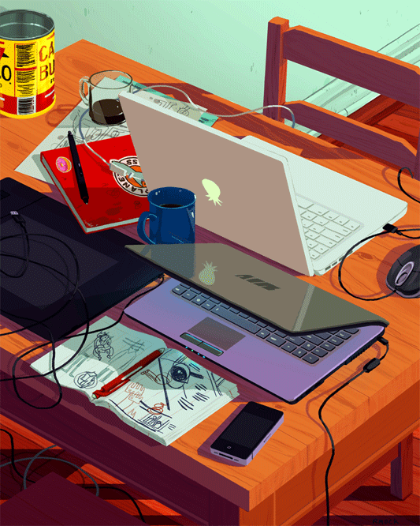

<h1 align="center">Hi 👋,  I'm  Kunal Pal</h1>
<h3 align="center">"John Wick of the web, taking down bugs 🐞 with deadly precision 💢 and style."</h3>

  

  

- 🌱 I’m currently learning **DSA & C++**

- 🖥️ Favourite line of code `clang++ -o main {actual_filename_with_extension}`

- 📫 How to reach me **kunal.cs.dev@outlook.com**
  

     

## My Skills  
<table align="center" width=90%>
  <tr>
    <th>Languages</th>
    <th>Frameworks, Libraries & Databases </th>
  </tr>
  <tr>
    <td>
	    

			  
		

	</td>
    <td>
	    

				  
		

	
  </tr>
  <tr>
	  <th>Tools and IDEs</th>
    <th>Operating Systems</th>
  </tr>
  <tr>
	  <td>
	   

				  
		

	  </td>
    <td>
	   

				  
		

	  </td>
  </tr>
</table>

   

## Connect with me  

  

  
  

   

   

  

   

----
